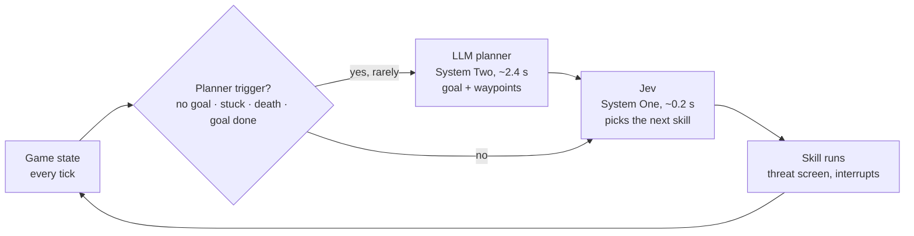
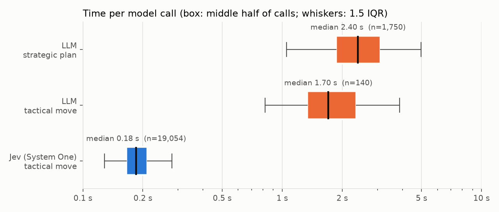
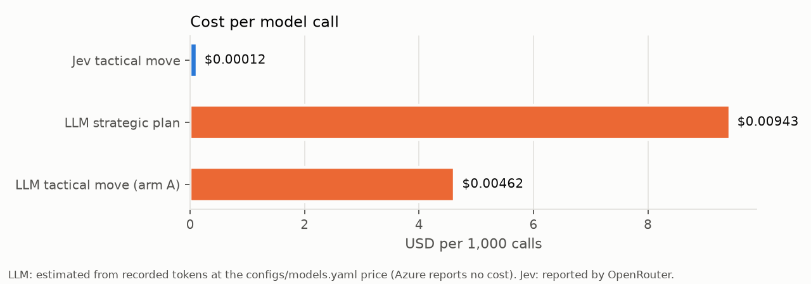
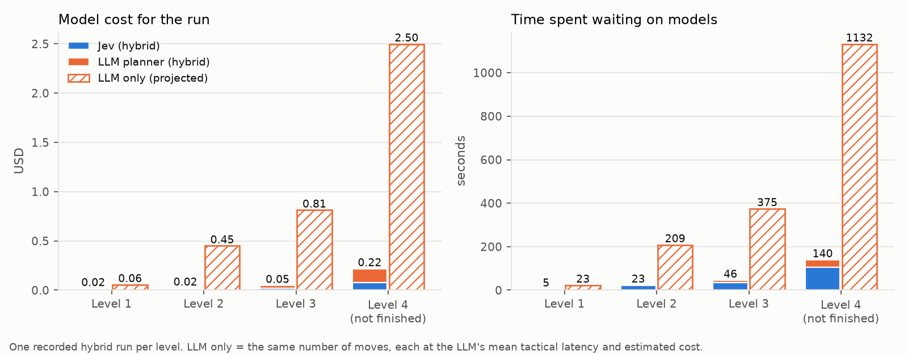
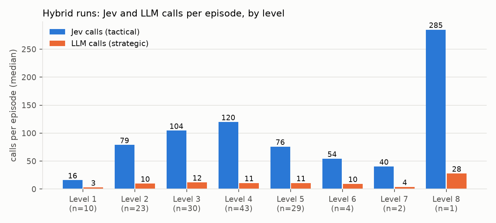
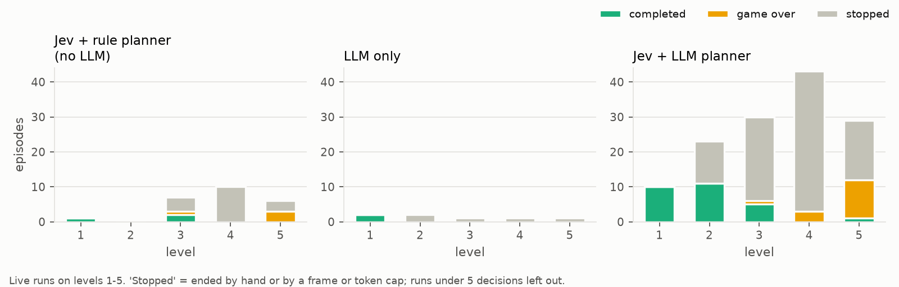

# Fast Hands, Slow Mind: a System One Model and an LLM Playing Dangerous Dave

*Draft article. Every number comes from the recorded live runs in `artifacts/live.sqlite`
(snapshot of 2026-10-08) through `scripts/article_figures.py`, which writes the charts below and
`images/numbers.json`. Projections are labeled as projections.*

```bash
uv run --with matplotlib python scripts/article_figures.py --store artifacts/live.sqlite --out docs/images
```

---

## Two kinds of thinking

Psychologists split thinking into two systems. **System One** is fast and automatic: you catch a
falling cup before you know you decided to. **System Two** is slow and deliberate: you plan a
route through a city you have never visited.

Today's large language models are, mostly, System Two machines. They reason well, they read a map,
they explain themselves, and they take seconds to answer. That is fine for an email. It is not fine
for anything that moves while you think: a robot arm, a car, a trading system, a game character
standing under a monster's fire.

**System One models** are built for the other half. TypeSafe's **Jev** takes structured state plus a
short list of options and returns a choice with a probability in about 0.2 s, for about a hundredth
of a cent. It does not write essays. It picks.

The claim of this article is simple: **neither kind of model is enough alone, and the pair is
better than either.** System One handles the moment; System Two handles the plan. To test that,
we made both play a game.

## The testbed: Dangerous Dave

*Dangerous Dave* (1990) is a side-scrolling platformer: find the trophy, reach the door, avoid
fire, water, vines and monsters that shoot back. We run the open-source
[deadly-dave](https://github.com/skoperst/deadly-dave) reimplementation headless and read the game's
real state each tick (`docs/feasibility.md`).

The models never press keys directly. They choose from **skills**, short calibrated moves such as
`move_right_3`, `jump_left_4`, `shoot` or `jetpack_on` (`docs/skills.md`). Before each choice a
physics simulation of the game screens every option against monsters and their shots, so each
option arrives with notes like `danger: the next shot hits in 46 ticks` or
`route: picks up the gun on the way`.

Crucially, **the LLM and Jev get exactly the same request**: the same state, the same rules text,
the same options with the same notes. Only the model differs (`docs/tactical.md`). Any difference
in play is the model, not the prompt.

## The split: who decides what



- **Strategic (LLM, System Two).** Chooses the goal: get the trophy, take the jetpack first,
  explore right. It sees the whole explored level as platforms with exits, what was tried and how
  it ended, and which moves killed Dave. It can return up to five waypoints. It is called only on
  events: no goal, stuck, repeated failures, a death, a goal finished (`docs/planner.md`).
- **Tactical (Jev, System One).** Every time a skill ends, Jev picks the next one from the screened
  options, steering toward the current waypoint. It is called dozens to hundreds of times per level.

In the latest configuration (`planning.llm_calls: escalate`) even the planner is layered: a cheap
rule chooses the obvious goal, and the LLM is asked only when Dave is stuck, dies, or the rule's
choice has already failed twice on the level.

## The two models side by side



| | Jev (System One) | LLM tactical move | LLM strategic plan |
|---|---|---|---|
| Calls recorded | 19,054 | 140 | 1,750 |
| Median latency | **0.18 s** | 1.70 s | 2.40 s |
| Mean latency | 0.20 s | 2.15 s | 2.69 s |
| 90th percentile | 0.25 s | 3.36 s | 4.03 s |
| Cost per call | **$0.00012** | ~$0.0046 (est.) | ~$0.0094 (est.) |



Per move, the LLM is about **10× slower and about 40× more expensive** than Jev. In the live viewer
the game ticks every 14 ms, so a Jev decision is about 14 ticks of Dave standing still, and an LLM
decision is about 150. A monster's plasma shot crosses the screen in about 2 s: one LLM decision.

## Jev without a plan: alive, and going nowhere

To see what System One does without System Two, we replaced the LLM planner with a hand-written
rule planner (trophy first, then door, then items, then explore) and kept Jev on tactics. No LLM
anywhere.

On **level 4**, Jev with the rule planner played 10 live episodes. It finished none, and lost only
6 lives in all of them. Typical runs:

| Run | Decisions | Frames | Deaths | Finished |
|---|---|---|---|---|
| `live-20261004T203431-60ace9` | 266 | 10,632 | 0 | no |
| `live-20261008T015232-4b01a5` | 211 | 5,701 | 0 | no |
| `live-20261007T004351-c507db` | 185 | 10,899 | 2 | no |
| paid run in `docs/progress.md` | 391 | 12,737 | 0 | no |

The last one is the clearest picture. Jev spent 391 decisions timing jumps around the swirl
monster's shots and **never died**, but Dave got no further than tile (26,3). The rule planner kept
switching between two loot items at (27,5) and (29,2) for most of the run. The trophy on level 4 is
reachable only by jetpack, and the jetpack is far to the right; a rule that says "trophy first"
cannot know that, and Jev, which only ever sees the next move, cannot either.

That is System One without System Two: **excellent reflexes, no idea where to go.** Every single
decision was locally sensible. The sum of them went nowhere.

(Fairness note: the rule planner is not nothing; it finished level 1 and twice finished level 3
with Jev. Level 3 has an obvious "go right" structure. Level 4 needs a detour, and that is where
the rule breaks.)

## The LLM alone: right moves, too slow

Arm A gives every tactical move to the LLM as well. It is good at it: it finished level 1 twice,
in 15 and 18 moves, with no deaths. But each move took a median 1.7 s (mean 2.15 s), and arm A was
played only 7 times because each run is slow to watch; the other 5 were stopped by hand after
10-39 moves.

In these runs the game **pauses** while a model thinks, so slowness costs only wall time. In a
real-time system it costs the game: with pausing off, the world keeps moving during every call
(`docs/live.md`). A 2 s decision in front of a shot is a death.

How long would the LLM take for a full level? We take each level's recorded hybrid run and replace
every Jev move with an LLM move at the LLM's measured mean latency and estimated cost (**projection,
not a measured run**):



Level 3 needs about 170 moves. Jev spends 36 s thinking; the LLM would spend about **6 minutes**,
for a level whose play takes 81 s of game time at the live viewer's pace. Level 4's unfinished 18,000-frame run had 510
moves: under 2 minutes of Jev thinking against about **19 minutes** of LLM thinking, and $2.50
instead of $0.22.

## Together, level by level

The hybrid gives the many small decisions to Jev and the few big ones to the LLM. Across 142
recorded hybrid episodes, the median episode calls Jev 5-10 times per LLM call; with the rule-first
`escalate` planner it is 40-100 times:



Here are four levels, one recorded hybrid run each, with the bill split by model.

### Level 1: the tutorial

`live-20261008T014020-24a001`, completed in 556 frames, 0 deaths.

| | Calls | Cost | Thinking time |
|---|---|---|---|
| Jev | 9 | $0.0015 | 1.9 s |
| LLM planner | 2 | $0.0143 | 3.5 s |
| **Total** | | **$0.0157** | **5.4 s** |
| LLM only (projected) | 9 moves + 2 plans | $0.056 | 23 s |

A short, open level: get the trophy, go to the door. Two plans and nine moves. The LLM is 91% of the
bill here even with only two calls; on easy problems, the slow model is the expensive part.

### Level 2: fire pits and a climb

`live-20261008T204413-99ed80` (escalate mode), completed in 3,971 frames, 0 deaths.

| | Calls | Cost | Thinking time |
|---|---|---|---|
| Jev | 96 | $0.0149 | 21.3 s |
| LLM planner | 1 | $0.0058 | 2.0 s |
| **Total** | | **$0.0207** | **23.2 s** |
| LLM only (projected) | 96 moves + 1 plan | $0.45 | 209 s |

The trophy sits up a zig-zag of ledges over a fire floor. The rule chose the trophy; the LLM was
called once. Jev made 96 moves around the fire without a death.

**Asking the LLM less is better here.** A level-2 run with the LLM asked for every goal
(`live-20261008T014051-836fa4`, `llm_calls: always`) also finished, but with 7 LLM calls, one death,
and **$0.075 instead of $0.021**: 3.6× the cost for the same result. (One run each; an anecdote,
not a statistic.)

### Level 3: the gun, the vines and the spider

`live-20261008T214808-1ac49a` (escalate mode), completed in 5,789 frames, 2 deaths.

| | Calls | Cost | Thinking time |
|---|---|---|---|
| Jev | 170 | $0.0204 | 36.4 s |
| LLM planner | 4 | $0.0273 | 9.2 s |
| **Total** | | **$0.0477** | **45.5 s** |
| LLM only (projected) | 170 moves + 4 plans | $0.81 | 375 s |

Level 3 needs the gun, a run of pillars over fire and vines, a spider that shoots from just off
screen, and the jetpack for the door. 18 of the 188 decisions were forced (Dave burning after a
death, one legal option, no model call). Jev did the shooting and the pillar jumps; the LLM was
called four times, when Dave was stuck or had died.

### Level 4: the jetpack detour (not solved)

`live-20261008T215038-4b17d1` (escalate mode), stopped at the 18,000-frame cap, 1 death.

| | Calls | Cost | Thinking time |
|---|---|---|---|
| Jev | 510 | $0.0753 | 105 s |
| LLM planner | 11 | $0.142 | 34.5 s |
| **Total** | | **$0.217** | **140 s** |
| LLM only (projected) | 510 moves + 11 plans | $2.50 | 1,132 s |

Level 4 is where the plan matters most: the trophy is reachable only by jetpack, the jetpack is
far to the right, and a swirl monster fires across the early ledges. Jev survived 510 moves with
one death. **No setup has finished level 4 yet**, hybrid included (43 hybrid episodes, 0
completions). Earlier LLM planners chose loot for almost a whole run and sent waypoints through
walls; the current one adds "take the jetpack first" prerequisites and fuel rules, and has not yet
finished the level either. This is the open problem, and it is a System Two problem.

### What the four levels show

| Level | Jev calls per LLM call | LLM share of cost | Hybrid cost | LLM-only cost (proj.) | Hybrid thinking | LLM-only thinking (proj.) |
|---|---|---|---|---|---|---|
| 1 | 4.5 | 91% | $0.016 | $0.056 | 5 s | 23 s |
| 2 | 96 | 28% | $0.021 | $0.45 | 23 s | 209 s |
| 3 | 42.5 | 57% | $0.048 | $0.81 | 46 s | 375 s |
| 4 | 46.4 | 65% | $0.22 | $2.50 | 140 s | 1,132 s |

The harder the level, the more moves it needs, and the gap between "LLM for everything" and
"LLM for the plan" widens: about 4× on level 1, 17-22× on levels 2-3, 11× on level 4. The few LLM
calls are still a large share of the hybrid's bill: one plan costs as much as 40-90 Jev moves.
Call the slow model rarely, and only when it changes something.

## All the runs



Every live episode, by setup. The hybrid finished level 1 in 10 of 10 runs, level 2 in 11 of 23,
level 3 in 5 of 30 and level 5 once in 29. Most "stopped" episodes were stopped by hand while the
harness was being developed between runs.

## Limits

This is development data, not a benchmark, and the article should say so:

- **Not a controlled comparison.** The runs span five days of code changes (threat screen, jetpack,
  planner prompt). Completion rates across setups are not comparable: on level 3 the rule planner
  with Jev finished 2 of 7 runs and the hybrid 5 of 30. The paired benchmark (`docs/benchmark.md`)
  has not been run with live models.
- **"Jev alone" means Jev plus a rule planner**, not Jev with no goal at all.
- **The LLM-only cost and time per level are projections** from the measured per-call mean, not
  runs. The LLM-only arm has 7 episodes.
- **Most runs pause the game** while a model thinks; only the live viewer's pause-off mode runs in
  real time, and it has not been run with live models.
- **Level 4 is unsolved** by every setup.
- **LLM costs are estimates** from recorded tokens at the configured price; Azure reports none.
  Jev's cost is reported by OpenRouter.

## Takeaway

A System One model is not a smaller LLM. It is a different tool: it answers in the time the world
gives you, for almost nothing, and on its own it has no idea where it is going. An LLM knows where
to go and is too slow and too expensive to drive. In Dangerous Dave, Jev made 19,054 decisions at
0.18 s each and kept Dave alive through monster fire; the LLM made the few calls that decide
whether those decisions add up to a finished level. Put the fast model in the loop, put the slow
model above it, and call the slow one only when something changes.
